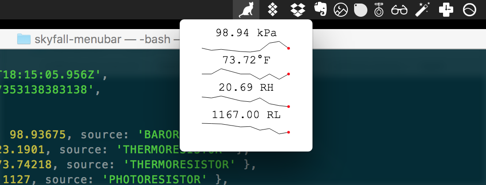

# SKYFALL Menubar app

> A miniature menubar application to display the latest data from [SKYFALL][0].

Data is updated every 30 seconds and each sparkline displays the last ~10 minutes of data for each sensor.

## Install
- Clone this repo
- `$ npm run build`
- `open SkyfallMenu-darwin-x64/SkyfallMenu.app/`

## Acknowledgments
- https://github.com/maxogden/menubar

## See Also
- https://github.com/andjosh/skyfall

## License

MIT

[0]: https://github.com/andjosh/skyfall
